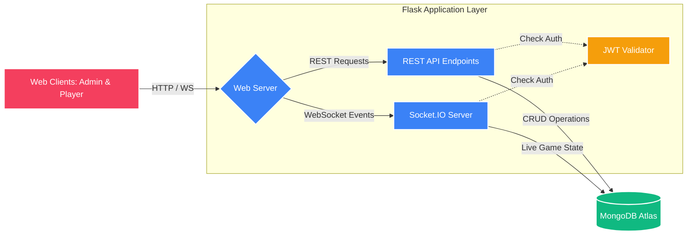
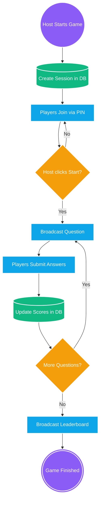
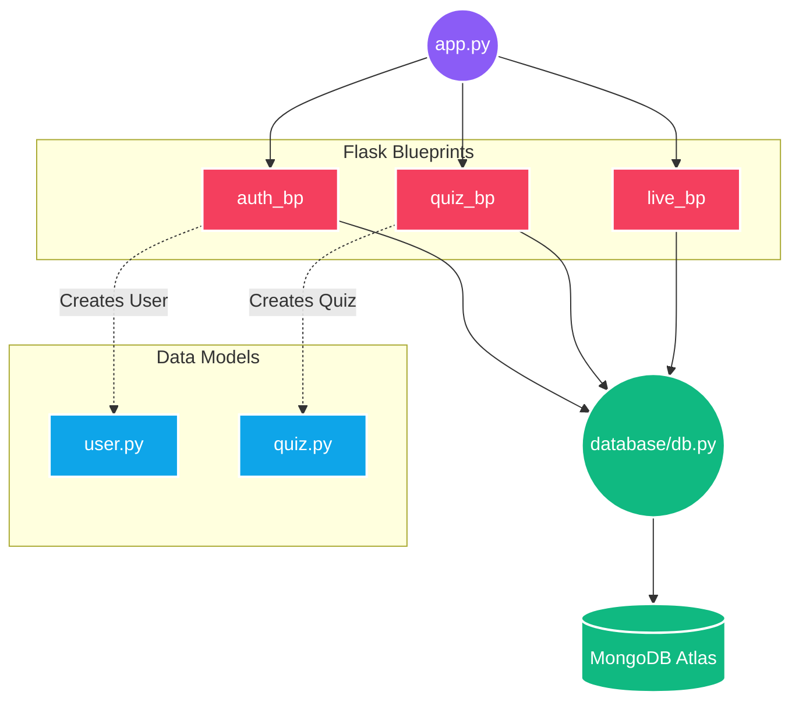

# System Architecture

## 1. High-Level System Architecture
This diagram outlines the overall infrastructure, showing the separation between the client applications, the backend server, and the cloud database.

## 2. Real-Time Game Flow (Socket.IO)
This flowchart breaks down the live quiz session loop. By using a flowchart instead of a sequence diagram, the logic is much cleaner and less cluttered!

## 3. Internal Application Architecture
This diagram breaks down the internal Python Blueprints and how they handle routing and business logic before interacting with the database.

